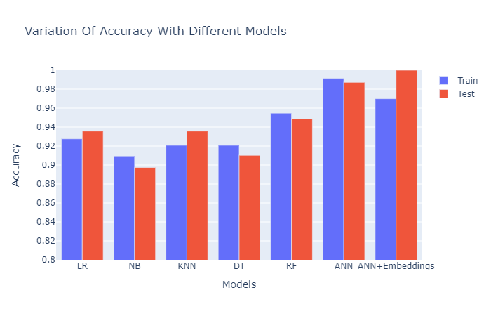
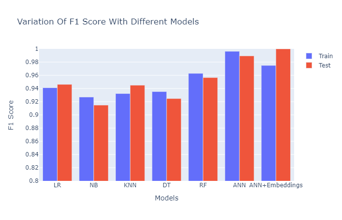
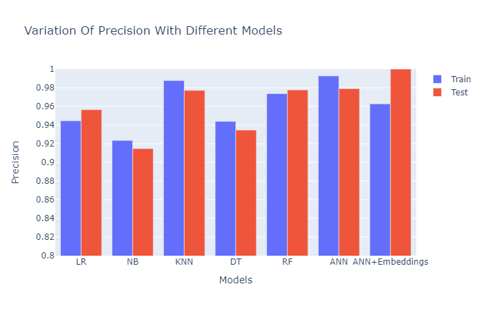
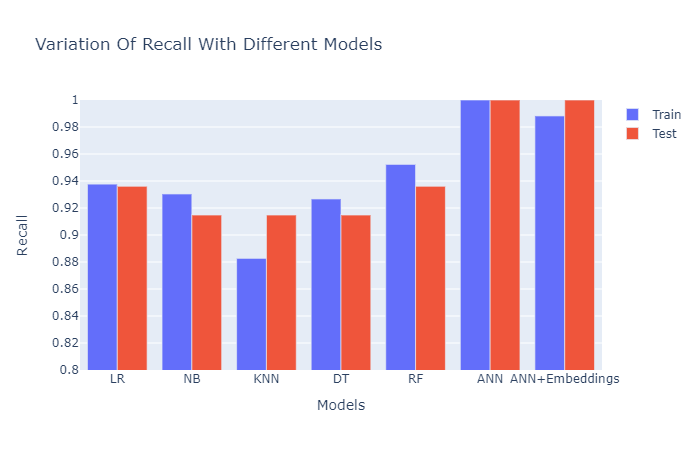
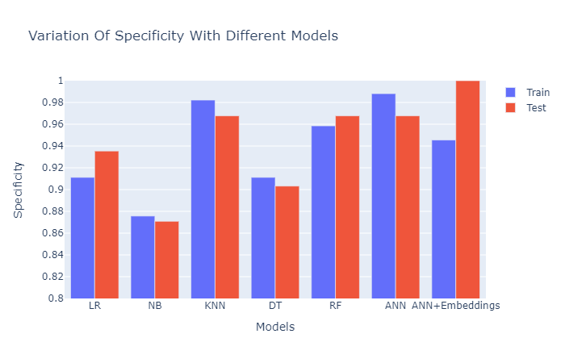

# Machine-Learning-Algorithms-for-The-Detection-of-Diabetes
## Paper link: https://www.irjet.net/archives/V8/i1/IRJET-V8I127.pdf

Diabetes is one of the fastest-growing chronic life-threatening diseases that is the seventh leading cause of death according to the estimation of WHO in 2016. Due to the presence of a relatively long asymptomatic phase, early detection of diabetes is always desired for a clinically meaningful outcome. Diabetes is a major cause of blindness, kidney failure, heart attacks, stroke, and lower limb amputation. These Could be avoided if it is detected in early stages. A large amount of clinical data available due to the digital era has made it possible for Deep learning techniques to give good results on medical diagnosis and prognosis. We use the diabetes dataset to train the model in predicting it. We have analyzed the dataset with Logistic Regression Algorithm, Random Forest Algorithm, Deep Neural Network, and a DNN having the embeddings for the categorical features. The DNN with embeddings makes the correct predictions on most of the test set examples i.e., nearly 100% of the examples, and has an F1 score of 1.0 on test data.

The main contributions of this paper are:
a)	We used the dataset from Islam, MM Faniqul, et al [https://link.springer.com/chapter/10.1007/978-981-13-8798-2_12] and used different algorithms like Decision tree, Random forest, logistic regression, Naïve Bayes, KNN, Neural network, and Neural Networks with embeddings in predicting diabetes.
b)	Our neural network using the embeddings layer on the categorical features learns a distributed representation of the categories. This method outperforms every other method leading to an accuracy of  100%, and an F1 score of 100% with sensitivity near to 100%. 

## ANN’s with embedding layers

Pure ANN’s are slightly biased towards predicting the diseased condition as its evident from a recall score of 1 and a precision of 0.97. ANN+embeddings has a test accuracy of 1 indicating that it predicts all the test examples correctly.

## Results

## Citation
Ranjith M S, Santhosh H S, Swamy M S Machine Learning Algorithms for the Detection of Diabetes IRJET Volume 8, Issue 1, January 2021  S.No: 27
